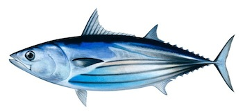
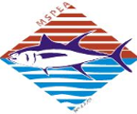

# Indian Ocean skipjack tuna model

[](https://travis-ci.org/iotcwpm/SKJ)
[](https://github.com/iotcwpm/SKJ/issues)

The Indian Ocean Tuna Commission's (IOTC) Working Party on Methods' (WPM) simulation model of the Indian Ocean skipjack (SKJ) tuna fishery for the evaluation of management procedures (MP).

> 

> Skipjack tuna (_Katsuwonus pelamis_)

## Documentation

The following document the model structure and code,

- [model/description](http://iotcwpm.github.io/SKJ/model/description) : a description of the model, including equations
- [parameters/description](http://iotcwpm.github.io/SKJ/parameters/description) : a description of the parameter priors and how they were derived
- [procedures/description](http://iotcwpm.github.io/SKJ/procedures/description) : a description of the candidate management procedures
- [doxygen](http://iotcwpm.github.io/SKJ/doxygen) : C++ code documentation generated by Doxygen

The following are based on model outputs (and should be updated after each model run; see below),

- [model/display](http://iotcwpm.github.io/SKJ/model/display) : model structure and variables (e.g. ogives, biomass trajectories)
- [data/display](http://iotcwpm.github.io/SKJ/data/display) : model fits to observed data (e.g. CPUE, size frequencies)
- [yield/display](http://iotcwpm.github.io/SKJ/yield/display) : yield curve and MSY calculations
- [feasible/display](http://iotcwpm.github.io/SKJ/feasible/display) : results from conditioning using the FST algorithm
- [ss3/display](http://iotcwpm.github.io/SKJ/ss3/display) : summarise of parameters obtained from the SS3 based stock assessment grid
- [evaluate/display](http://iotcwpm.github.io/SKJ/evaluate/display) : results from evaluations of management procedures

## Reports

Several reports associated with this project are available (in chronological order; you may want to skip to the end):

- [Adam, M. S., R. Sharma and N. Bentley (2013). Progress and arrangements for management strategy evaluation work of Indian Ocean skipjack tuna. IOTC-2013-WPTT15-12, Paper submitted to Working Party on Tropical Tuna, San Sebastian, Spain.](http://www.iotc.org/documents/process-and-arrangement-management-strategy-evaluation-indian-ocean-skipjack-tuna )

- [ISSF (2014). ISSF Report of the 2014 Meeting of the Indian Ocean Skipjack MSE Advisory Committee Meeting. 14-16 October 2014, Media One Hotel, Dubai, United Arab Emirates. 13 pp.](http://iss-foundation.org/resources/downloads/?did=548)

- [Bentley, N and M.S. Adam  (2014). Management strategy evaluation for Indian Ocean skipjack tuna fishery: first steps. IOTC-2014-WPTT16-39. Paper submitted at the 16th Meeting of the Working Party on Tropical Tuna, Bali, Indonesia, 15-19 November 2014](http://www.iotc.org/documents/management-strategy-evaluation-indian-ocean-skipjack-tuna-first-steps)

- [Bentley, N and M.S. Adam  (2014). Management procedure evaluation for Indian Ocean skipjack tuna fishery: model description and conditioning. IOTC-2014-WPM05-08. Paper submitted at the 5th Meeting of the Working Party on Methods, Seychelles, 05-06 December 2014](http://www.iotc.org/documents/management-procedure-evaluation-indian-ocean-skipjack-tuna-fishery-simulation-model)

- [Bentley, N and M.S. Adam  (2014). Management procedure evaluation for Indian Ocean skipjack tuna fishery: management procedure descriptions and evaluations. IOTC-2014-WPM05-09. Paper submitted at the 5th Meeting of the Working Party on Methods, Seychelles, 05-06 December 2014](http://www.iotc.org/documents/management-procedure-evaluation-indian-ocean-skipjack-tuna-fishery-management-procedure)

## Support

This work has been funded by the [International Pole and Line Foundation (IPNLF)](http://ipnlf.org/), the Maldives Seafood Processors and Exporters Association (MSPEA) and [WWF](http://wwf.panda.org) with support and oversignt of the Maldives [Marine Research Centre (MRC)](http://www.mrc.gov.mv/). Support for the project's Advisory Committee has been provided by the [International Seafood Sustainability Foundation (ISSF)](http://iss-foundation.org/).

<div align="center">
	
	
	
	
</div>

## Status

The model is still under active development. As the model matures we hope to make it available as precompiled executables for Windows and Linux and/or a package for R.

Automated builds are done on [Travis CI](https://travis-ci.org/iotcwpm/SKJ) when changes are pushed to this repository.


## Usage

To run the executable, `ioskj.exe`, supply a task name and, for certain tasks, additional arguments,

```
./ioskj.exe <task> [<arg1>],[<arg2>]...
```

Tasks include,

- `run`
- `priors`
- `feasible <trials>`
- `evaluate <replicates>`

For example, to evaluate the defined set of management procedures using 1000 replicates run,

```
./ioskj.exe evaluate 1000
```

## Building

The project `Makefile` includes a task (`make requires`) which will download and compile required C++ libraries. Use `make compile` to compile a production version of the executable.

On most Linux systems you should have the required build tools installed already and can just run:

```shell
make requires compile
```

On Windows, the recommended approach is to build using MSYS2 and MinGW64:

 1. Download and install MYSYS2 following the instructions at https://msys2.github.io/

 2. Open the MYSY2 shell and install build tools:

	```shell
	pacman -S make mingw-w64-x86_64-toolchain zip
	```

 3. Open the MinGW64 shell and run:

	```shell
	make requires compile
	```

To build a debug version of the executable for use with [GDB](http://www.gnu.org/software/gdb/) run,

```
make debug
```

To update all documentation run,

```
make docs
```

To publish documentation to http://iotcwpm.github.io/SKJ run,

```
make publish
```

## Organisation

The C++ code is divided into several files:

- `imports.hpp` - `#include`s to import classes and functions from external libraries
- `dimensions.hpp` - defines the dimensions used in various model arrays e.g. `Region`, `Age`, `Method`
- `model.hpp` - contains the `Model` class which specifies the structure and dynamics of the fishery
- `parameters.hpp` - contains the `Parameters` class which defines the parameters and their priors used for model conditioning
- `data.hpp` - contains the `Data` class which defines the data sets and their likelihoods used for model conditioning
- `ioskj.cpp` - the primary C++ file for compiling the executable
- `tests.cpp` - unit tests of the C++ code

Some of these files have corresponding folders,

- `parameters` : R scripts for background analyses for developing model prior probability distributions.
- `data` : R and Python scripts for processing source data. See the documentation in those files for more details.

In addition there is a folder related to documentation,

- `doxygen` : a Doxygen project for automatically generating documentation from C++ source code.
